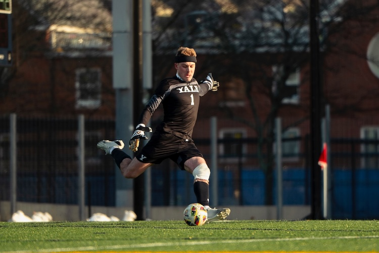

  

  Hi there! My name is Conrad Lee. I’m an Applied Mathematics student at Yale University. 
  

  

  
  

  

    
  

  

    I’m an aspiring data scientist who loves explaining complex concepts to people.
  

  

  I’m from the foothills of southern Montana, where the Great Plains meet the Rocky Mountains. 
  

  

  
  

  

  
  

  

  My rural upbringing left me with a deep curiosity for the world and a sense of social responsibility, two traits that define who I am today.
  

  

  When I’m not looking to use data to help people, I like playing soccer.
  

  

  
  

  

  
  

  

  I’m drawn to teams that can solve big problems together. I’m inspired by groups that are greater than the sum of their parts.
  

  

  I enjoy challenging myself and learning new things.
  

  

  
  

  

  
  

  

  And I appreciate a good sense of humor.
  

 

I’m currently looking for next steps after graduation. If you can help me find a new home for my analytical mind, please don’t hesitate to [contact me](mailto:conrad.lee@yale.edu). I’d love to hear from you.
