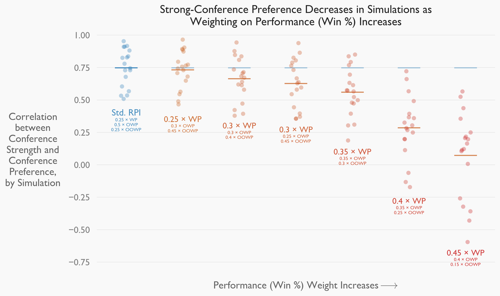
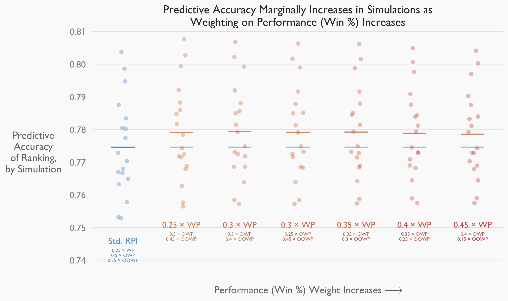
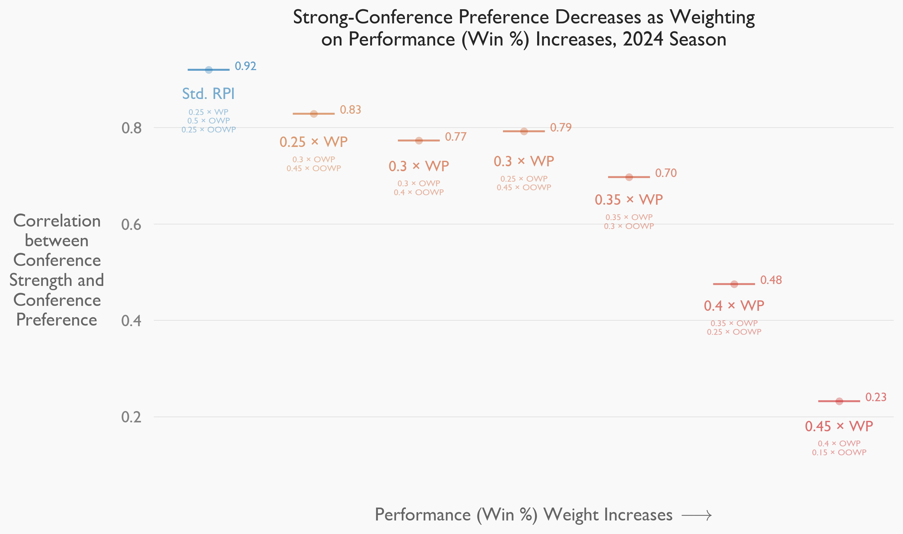
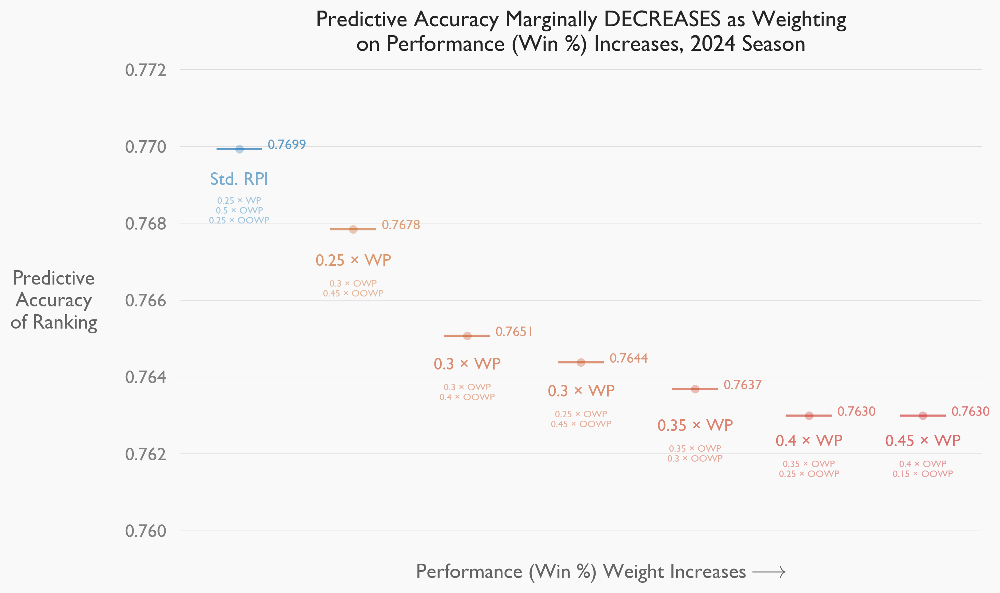
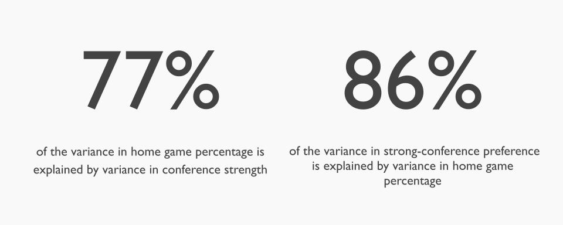

This is a high-level overview of my senior undergraduate thesis. If you're looking for the nitty-gritty, you can download the complete thesis <a href="AMTH_Thesis_CL.pdf" download>here.</a>

## What is RPI?

The NCAA uses the Rating Percentage Index (RPI) to rank college soccer teams. RPI is determined by:

<strong>(0.25 &times; WP) + (0.50 &times; OWP) + (0.25 &times; OOWP) + A</strong>

where, for each team,
- "WP" is their *Win Percentage*;
- "OWP" is their *Opponents' Win Percentage*;
- "OOWP" is their *Opponents' Opponents' Win Percentage*; and
- "A" is a small adjustment accounting for home-field advantage.

At the end of the regular season, the NCAA publishes the RPI rankings for all Division I (D1) Men's Soccer teams. These rankings are a key factor in determining which 26 teams receive at-large bids to participate in the NCAA D1 Men's Soccer Championship.

## Motivation

Note that only 25% of the RPI formula is weighted on a team's **performance (WP)**. The other 75% is weighted on a team's **context (OWP + OOWP)**.

It has been claimed that *RPI is biased towards teams from stonger conferences because of its weight on **context** over **performance**.* However, I couldn't find a formal investigation of this claim for D1 Men's Soccer. So, I decided to do one myself.

(Chris Thomas does an excellent statistical analysis for NCAA D1 Women's Soccer. You can and should view his work *here*.) 

## Procedure

- First, simulations were performed to **identify potential reweightings** of the RPI formula.
- Then, these reweightings were **evaluated on simulated data**. Reweighted rankings were assessed for **two criteria**: *predictive accuracy* (how often the higher-ranked team wins) and *preference for stronger-conference teams*.
- Lastly, these reweightings were **reevaluated on real 2024 season data** using similar methodology. 

## Analysis and Results

### Selection of Reweightings

I started by performing six different sets of 1000-season simulations, varying parameters each time. I then determined predictive accuracy for *all* potential weightings of the RPI formula. The best are shown below.

<!-- 
<table class="custom-table">
  <caption>Best RPI Weightings Vary With Simulation Parameters</caption>
  <thead>
    <tr>
      <th>Simulation</th>
      <th>Best RPI Weighting (WP, OWP, OOWP)</th>
    </tr>
  </thead>
  <tbody>
    <tr>
      <td>Simulation 1</td>
      <td>(0.25 &times; WP) + (0.30 &times; OWP) + (0.45 &times; OOWP)</td>
    </tr>
    <tr>
      <td>Simulation 2</td>
      <td>(0.25, 0.30, 0.45)</td>
    </tr>
    <tr>
      <td>Simulation 3</td>
      <td>(0.45, 0.40, 0.15)</td>
    </tr>
    <tr>
      <td>Simulation 4</td>
      <td>(0.30, 0.25, 0.45)</td>
    </tr>
    <tr>
      <td>Simulation 5</td>
      <td>(0.45, 0.40, 0.15)</td>
    </tr>
    <tr>
      <td>Simulation 6</td>
      <td>(0.30, 0.30, 0.40)</td>
    </tr>
  </tbody>
</table>
-->

<table class="custom-table">
  <caption>Most Predictive RPI Weightings Vary With Simulation Parameters</caption>
  <thead>
    <tr>
      <th>Simulation</th>
      <th>Best WP Weighting</th>
      <th>Best OWP Weighting</th>
      <th>Best OOWP Weighting</th>
    </tr>
  </thead>
  <tbody>
    <tr>
      <td>Simulations 1 + 2</td>
      <td>0.25</td>
      <td>0.30</td>
      <td>0.45</td>
    </tr>
    <tr>
      <td>Simulations 3 + 5</td>
      <td>0.45</td>
      <td>0.40</td>
      <td>0.15</td>
    </tr>
    <tr>
      <td>Simulation 4</td>
      <td>0.30</td>
      <td>0.25</td>
      <td>0.45</td>
    </tr>
    <tr>
      <td>Simulation 6</td>
      <td>0.30</td>
      <td>0.30</td>
      <td>0.40</td>
    </tr>
  </tbody>
</table>

These four highest-performing weightings were selected for further analysis. Two high-performing weightings (both with *WP > 0.25*) were added to diversify the selection:
- (0.35 &times; WP) + (0.35 &times; OWP) + (0.30 &times; OOWP)
- (0.40 &times; WP) + (0.35 &times; OWP) + (0.25 &times; OOWP)

### Evaluation of Reweightings on Simulated Data

I then ran more 1000-season simulations, varying parameters each time, to more thoroughly assess each ranking's strong-conference preference and predictive accuracy. 

I compared results for reweightings with those for the standard RPI weighting *(0.25 &times; WP) + (0.50 &times; OWP) + (0.25 &times; OOWP)*.

  

  

The standard RPI weighting *prefers teams from stronger conferences at the expense of predictive accuracy*. In other words, this weighting is *biased towards stronger conference teams* in the context of these simulations.

### Evaluation of Reweightings on 2024 Season Data

I validated simulation results by assessing strong-conference preference and predictive accuracy on the 2024 NCAA D1 season for each ranking.

Again, I compared reweighting results with those for the standard RPI weighting (0.25, 0.5, 0.25).

The standard RPI weighting still *prefers teams from stronger conferences*. However,

the standard RPI weighting also has a *higher predictive accuracy*, 

Why is this? It's likely because of an *unequal distribution of home-field advantage across conferences*. 

Teams from stronger conferences enjoy the benefit of playing more games at home. This boosts win percentage and RPI. *This meanss the predictive accuracy metric favors teams that play more games at home (and win more), **not teams that are actually stronger***. 

Because of this, the predictive accuracy results for the 2024 season *do not contradict* the simulation results. When home advantage is unequally distributed, *a stronger predictive accuracy doesn't necessarily imply a stronger ranking system*. We can no longer assume that on-field results provide the only proxy for team strength.

More analysis is needed to confirm this interpretation. (Coming soon?)

## Conclusions and Recommendations

My paper concludes with some specific recommendations for the NCAA, including:
- Changing the RPI formula to account for home-field advantage
- Changing the RPI formula to increase the relative weighting on performance (WP)

My analysis leaves room to be expanded, especially with home-field advantage and with data from pre-2024 seasons.