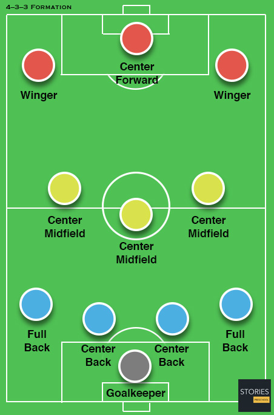
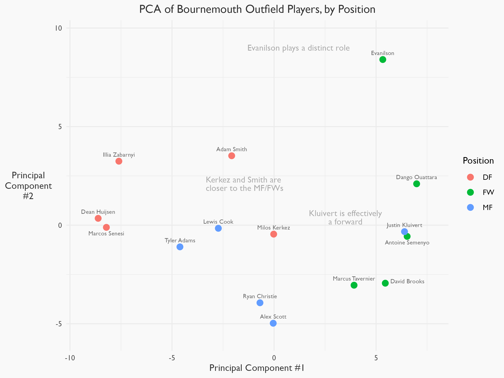
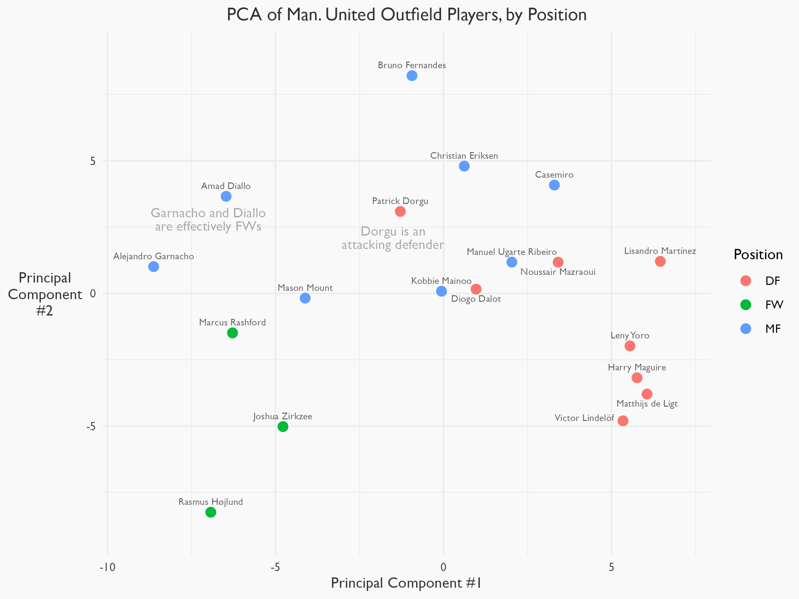
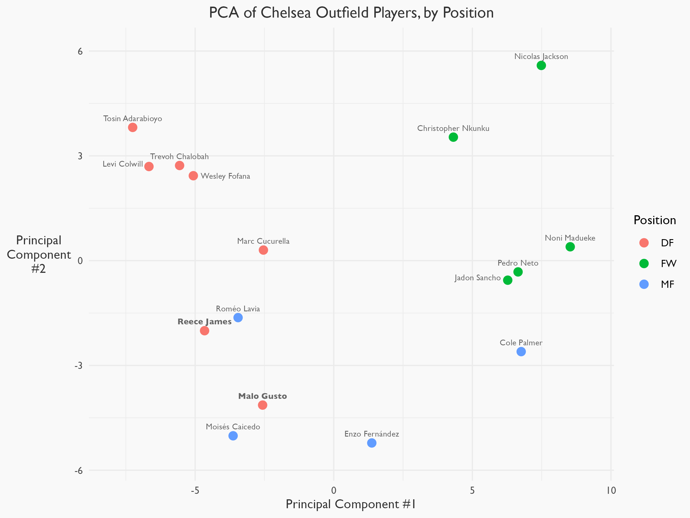
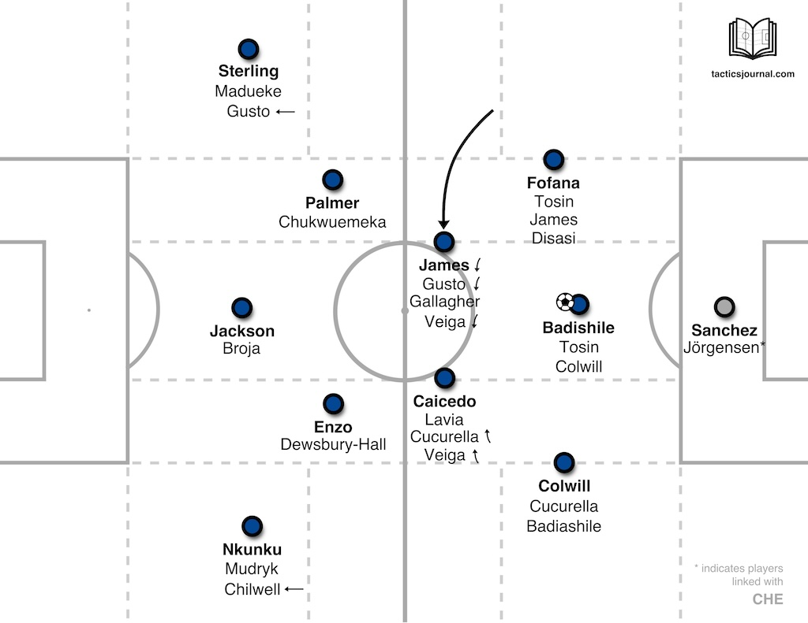
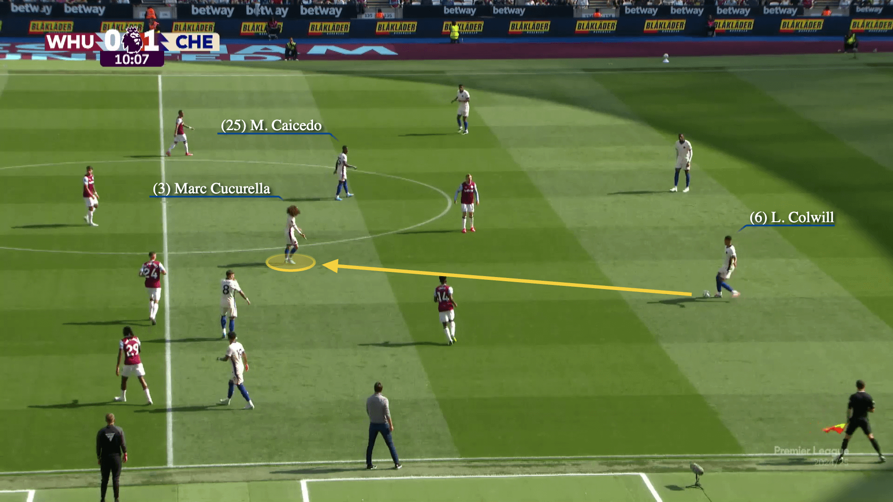
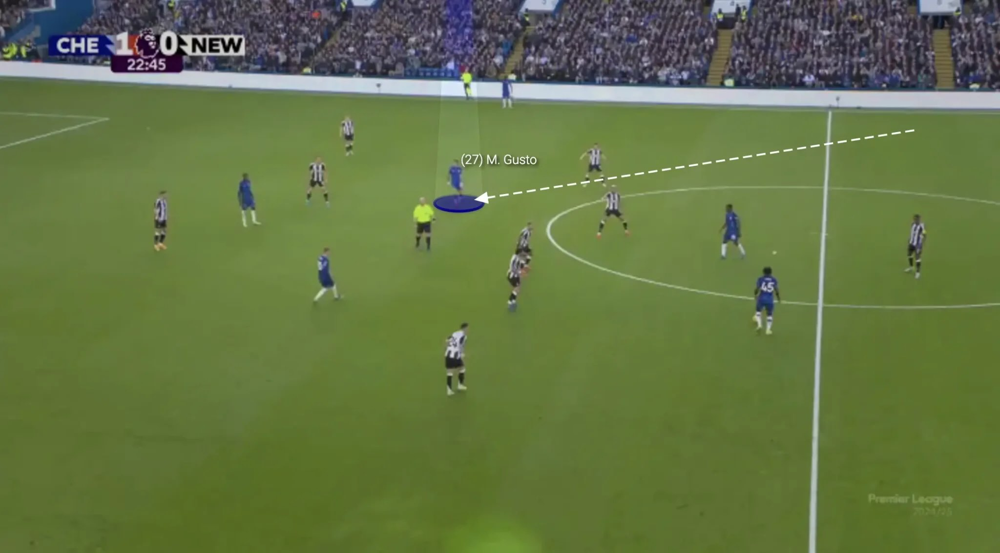

This is a summary of my group's final project for Yale's AMTH 232: Advanced Linear Algebra with Applications.

## The Problem

When analyzing a soccer player, we want to have a way of thinking about their *role* on the field. The simplest way to do this is through the label of a player's **position**. This represents where they lie in the formation of a team. 

Managers (or coaches) use formations to give the players on the field a sense of structure. It's the first tactical and stylistic choice that every coach makes. So when managers talk about a **4-3-3**, what they really mean is a birds-eye view like this:

<a href="https://www.storiespreschool.com/soccer_formation433.html">Image credit: Stories Preschool</a>

with 4 defenders, 3 midfielders, and 3 forwards/attackers.

Each of these positions comes with relative attributes expected of them. For example, we should expect forwards to score more goals than defenders, and we should expect defenders to block more shots than forwards. 

But this is just in theory. In practice, players aren't beholden to the attributes of their position. Their roles are fluid and they play to their strengths. They move all around the field, interchangings positions and adapting to different demands based on their strengths. *Role is more nuanced than a simple definition of position.*

So how can we better quantify a player's role? Position labels are *qualitative*, but we want something *quantitative*. We can compare a collection of player stats (like goals scored) and start getting an idea. 

However, if we can use all stats to **create a single metric** for comparing all players on the field, we can better understand how a player fits within their team. And, with this information, maybe we can identify players that could play in different positions-- or players whose positional label doesn't reflect their true role on the field.

## The Method

Enter dimension reduction. This will allow us to **project high-dimensional data onto lower dimensions**, meaning we can visualize all of a player's stats in (for our project) two dimensions. 

The main dimension technique we used in our final project was Principal Component Analysis, or PCA. This is a **linear technique** for **projecting high-dimensional data onto lower dimensions** in a way that **captures the most variance in the data**. (Using non-linear dimension reduction techniques such as t-SNE is a topic for further analysis, as we only briefly touched on them in our project.)

## The Procedure

Our group chose to analyze the player positions with four Premier League teams from the 2024-25 PL season:
- Liverpool FC
- AFC Bournemouth
- Manchester United FC
- Chelsea FC

*Within each team,* player data was pulled from FBRef. For all field players (excluding goalkeepers), 75 different statistics were used, including metrics for passing, shooting, defending, and others. 

Some notes on how these metrics were chosen:
- All metrics were standardized by minutes played to ensure comparability.
- We used expected goals and assists (xG/xA) instead of goals and assists. Expected goals gives us a better measure of a player's goalscoring threat than goals itself, as whether a shot goes in or not is somewhat random.
- We excluded most set piece statistics, as we're focused on player contributions *in open play*.
- This is an analysis *within* each team-- we're comparing players across positions. You could just as easily compare players *across* teams and *within* positions.

We then applied PCA to this dataset to project the data onto two dimensions. This low-dimensional data allows us to visualize how players cluster across positions-- and to see if any players stand out.

## The Results

Let's start with the Liverpool PCA plot.

The players are clustered well by position. For example, van Dijk (top right) is much closer to Konate than he is to Salah. But there are some interesting findings as well, as shown on the graph.

Note that the axes defy simple interpretation-- they're determined by what preserves the most variance in the data, without any soccer/tactical rationale. But it would appear that the first principal component separates well into players further up the field (on the left) and further back (on the right).

Now let's take a look at the Bournemouth PCA plot.

The axis is flipped, but the plot still filters between defensive players (to the left) and attacking players (to the right) with the first principal component. Based on this plot, we can identify more aggresive "defenders" (Kerkez and Smith) and more defensive "midfielders" (Adams and Cook).

Manchester United is next.

Again, the first pricipal component discrimates between more defensive players and more offensive players. Note that patterns in this plot may be skewed by the fact that Manchester United changed its manager midway through the season.

Lastly, let's look at the Chelsea plot.

There's a lot of information conveyed in these charts, especially for those who aren't as familiar with soccer or PCA. Let's do a deeper dive into this last chart to get a better idea of what it's telling us.

## Analysis: Chelsea Defenders

Take another look at the bottom left of the Chelsea PCA plot.

Gusto and James are defenders, but they're clearly clumped with the midfielders (Gusto especially). Why?

You can <a href="https://youtube.com/shorts/KyGFLo8xtak?feature=shared" >click here</a> to see Enzo Maresca, the manager of Chelsea, explain.

At the beginning of the video, Maresca says that he like to have one of his wide defenders play like a central midfielder when his team has the ball. Like this:

<a href="https://tacticsjournal.com/2024/07/25/chelsea-will-use-inverted-fullbacks/">Image credit: Tactics Journal</a>

Gusto and James are often the players that "invert" into this central position. Some screenshots from Premier League games show this well.

<a href="https://www.nytimes.com/athletic/5793505/2024/09/26/cucurella-inverted-full-back/">Image credit: New York Times</a>

<a href="https://the-footballanalyst.com/inverted-fullbacks-football-tactics-explained/">Image credit: The Football Analyst</a>

No wonder Gusto and James are clumped with the other midfielders-- they essentially are midfielders! Their label as a "defender" doesn't reflect their true role. In this way, the PCA plot shows us the latent structure of the Chelsea team that simple positional labels do not.

## The Conclusion

Our simple PCA method allows us to better understand player roles within a team and how they relate to a player's "position". These plots allows us to make complex inferences about the tactical structure for multiple Premier League teams.

This is just a start-- there's lots of room to continue this analysis! Let me know what you think.